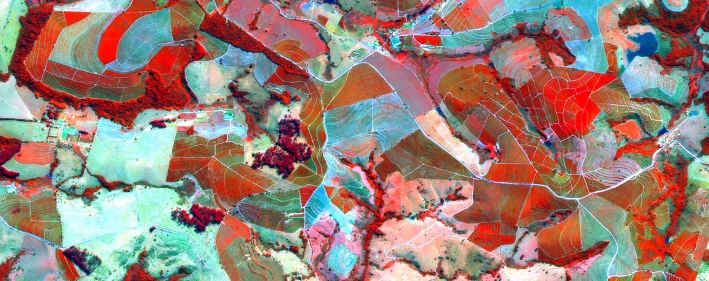
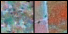
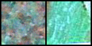
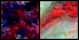
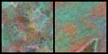
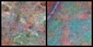
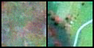
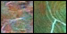
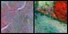

# Task 1 - Adapt diffusion model for map generation.

<!-- #region -->
<p align="center">

</p>

The task was performed within the contest for the position of ML-engenner at Skoltech Applied AI Center.
Goal of the project was to adapt existing diffusion DL model (https://github.com/cloneofsimo/minDiffusion) for map generation purposes. 

Scoring is shown below:
- Model should generate pictures similar to te real Earth maps with dimmention of (64x64) (10 point);
- Dataset preparation quality will be reviewed (5 points);
- Modifications of the existing code should be shown.

# Introduction

Diffusion models became very promising nowadays, as being recently introduced it is already shown perfect results. 
The core concept behind these models is deceptively simple:

- Take a starting image;
- Add some noise, iteratively degrading the image until almost nothing but noise remains;
- Train a model to 'undo' these noise steps;
- To generate, start from pure noise and repeatedly apply the model to 'denoise' our way back to a plausible image.

Being alternative to GANs, today's Diffusion models show: 

- [x] **High-quality sampling**

- [x] **Mode coverage and sample diversity**

- [ ] **Slow and computationally expensive sampling**

# Getting started
Current DL code was tested localy with NVIDIA RTX 2060 mobile (cuda 11.6) and python 3.9.12. 

It presents refactored initial repo with adaptation for map generation

Requiremnet can be found at:

```
requirements.txt
```

Map dataset was taken from Awesome Satellite Imagery Datasets (https://github.com/chrieke/awesome-satellite-imagery-datasets).
This dataset is a composition of scenes taken by SPOT Satellite sensor in 2005 in Brazil. Dataset includes pictures of coffee/non-coffee fields (2 labels).
As author loves coffee :)

Can be downloaded and unpacked by:
```
!wget http://www.patreo.dcc.ufmg.br/wp-content/uploads/2017/11/brazilian_coffee_dataset.zip
!unzip -qq brazilian_coffee_dataset.zip
```

Map_generator.py - main executable file which should be execuited in same environment with tools.py

# Discussion of results:

Initial autor took 2 hours of training on dectop 3090 GPU for Cifair10 dataset wich is 32x32. 
Current aoutor run train for two hours on mobile 2060 GPU for 64x64 images, so results might be not so stunning, but nevetheless.

Have a look on the selected by author "good" examples of the map generation (couples of the pictures)

              (on the left side - generated map                      on the right - reals coffee plants field from dataset)


<p align="center">

</p>
<p align="center">

</p>
<p align="center">

</p>
<p align="center">

</p>
<p align="center">

</p>
<p align="center">

</p>
<p align="center">

</p>
<p align="center">

</p>

# Updates of the existing repo

- requirements.txt was added, as well as short intro for position of diffusion models in today's DL, and Tools.py file with imports
- some typos as cuda:1 exchenged to cuda:0, 
- some additional helpfull annotations were added to the code
- compositon of the classes and functions refactored, the redundant ones have been removed
- loss functions were testd, NAdam; SGD goes to infinity
- map pictures for dataset loader framework was added
- save model and pictures only on appropriate epochs
- trained model uploaded

WHAT CAN BE CHANGED ELSE

- lear variance, not only mean of gausian noise
- class traking (conditional sampling)
- β sheduler can be more complex (e.g. cosine sheduler)
